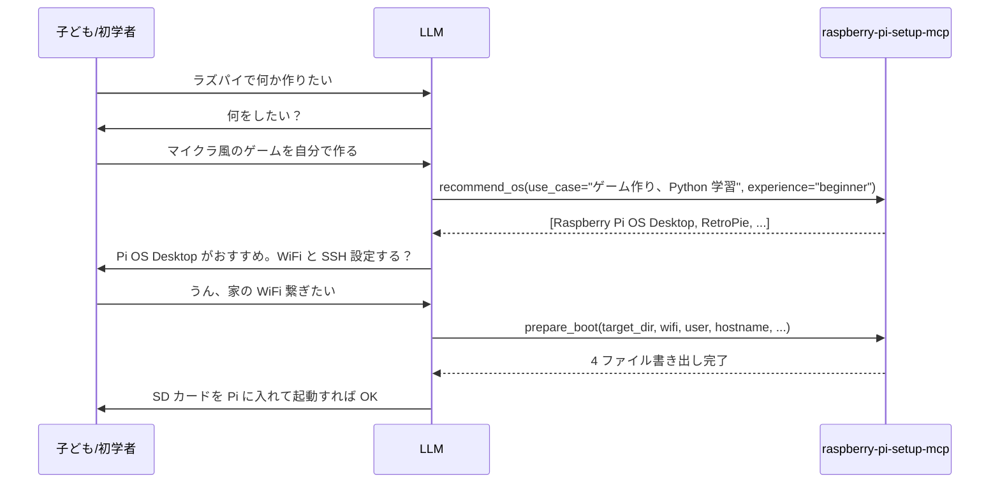

<div align="center">

# raspberry-pi-setup-mcp

### Raspberry Pi 初期セットアップ対話ウィザード MCP サーバー

[](src/index.ts)
[](package.json)
[](https://www.raspberrypi.com/software/)
[](https://modelcontextprotocol.io/)
[](LICENSE)

**「何に使う？」から相談に乗り、ヘッドレス起動ファイル一式を自動生成。**

---

</div>

## 概要

LLM エージェントが初学者（特に**子ども**）と対話してラズパイを立ち上げる為の MCP。用途ヒアリングからの OS 推薦、WiFi/SSH/ユーザー/ホスト名などの設定ファイル生成までを一撃で。

LLM に `ffmpeg -i ...` を書かせないのと同じ理屈で、LLM に `wpa_supplicant.conf` や `userconf.txt` を**手書きさせない** — 間違うと初回起動で詰む。このサーバーは正しいフォーマット・権限・配置場所を保証する。

## 特徴

| アクション | 用途 |
|---|---|
| `list_os` | カタログ全件（Pi OS / Ubuntu / LibreELEC / RetroPie / HASS / DietPi / Alpine 等）を `good_for` タグ付きで返す |
| `recommend_os` | `use_case` (日本語 OK) + `experience` で 5 件推薦 |
| `generate_wpa_supplicant` | `wpa_supplicant.conf` 本文生成（WPA-PSK / オープン / 複数 SSID 対応） |
| `generate_userconf` | Bookworm 以降の `userconf.txt` 生成。`password` (openssl で hash 化) か `password_hash` 直指定 |
| `generate_firstrun` | 初回起動スクリプト `firstrun.sh` 生成（ホスト名 / ロケール / TZ / SSH 公開鍵配置 / 任意コマンド） |
| `enable_ssh_instructions` | `ssh` 空ファイルの作り方説明 |
| `prepare_boot` | `target_dir` に上記を**まとめて書き出す**（SD の boot パーティションを直接指定する想定） |
| `hash_password` | `password` → `$6$...` SHA-512 crypt ハッシュ |
| `check_requirements` | openssl / rpi-imager / Node / platform の検出 |
| `cloud_init_ubuntu` | **Ubuntu Server Pi 用 user-data YAML 生成**。hostname / timezone / locale / user (password は openssl で自動 hash) / `ssh_pubkey` / `wifi` (netplan 形式) / `packages` / `runcmd` |
| `dietpi_config` | **DietPi 固有の dietpi.txt + dietpi-wifi.txt** を同時生成。locale / keyboard_layout / timezone / `dietpi.headless` / `dietpi.ssh_server` / `dietpi.autostart` 対応 |
| `list_block_devices` | Windows (PowerShell `Get-Disk`) / macOS (`diskutil`) / Linux (`lsblk -J`) をプラットフォームごとに叩いて JSON 正規化 |
| `generate_ssh_keypair` | `ssh-keygen` シェルアウトで ed25519 / rsa / ecdsa キーペア生成。`ssh_key_comment` / `ssh_key_passphrase` / `ssh_key_type` / `ssh_key_bits` 対応、SHA256 フィンガープリント付き |

## 想定フロー



## インストール

```bash
git clone https://github.com/cUDGk/raspberry-pi-setup-mcp.git
cd raspberry-pi-setup-mcp && npm install && npm run build
```

- Windows: `openssl.exe` が PATH にある事（Git Bash 付属版 or [公式](https://slproweb.com/products/Win32OpenSSL.html)）
- macOS/Linux: openssl は通常プリイン

## 使い方

```bash
claude mcp add rpi -- node C:/Users/user/Desktop/raspberry-pi-setup-mcp/dist/index.js
```

### 呼び出し例

用途相談:
```json
{"action": "recommend_os", "use_case": "Python プログラミング学習", "experience": "beginner"}
```

一括書き出し:
```json
{"action": "prepare_boot",
 "target_dir": "E:/",
 "wifi": {"ssid": "MyWiFi", "psk": "password", "country": "JP"},
 "enable_ssh": true,
 "user": {"username": "kiddo", "password": "learnpi"},
 "hostname": "pi-kiddo",
 "locale": "ja_JP.UTF-8",
 "timezone": "Asia/Tokyo"}
```

`target_dir=E:/` が SD の boot パーティションのマウント先。Windows だとドライブレターが自動で振られる。

**Ubuntu Server Pi のヘッドレス設定** (cloud-init):
```json
{"action": "cloud_init_ubuntu",
 "hostname": "pi-home",
 "timezone": "Asia/Tokyo",
 "user": {"username": "pi", "password": "setpasswd", "sudo_nopasswd": true},
 "wifi": {"ssid": "MyWiFi", "psk": "secret", "country": "JP"},
 "ssh_pubkey": "ssh-ed25519 AAAA... user@host",
 "packages": ["docker.io", "git", "vim"],
 "runcmd": ["usermod -aG docker pi"]}
```
→ `user-data` として `system-boot` パーティション直下に配置 (空の `meta-data` も必要)。

**DietPi の初期設定**:
```json
{"action": "dietpi_config",
 "hostname": "mydietpi",
 "timezone": "Asia/Tokyo",
 "wifi": {"ssid": "MyWiFi", "psk": "secret", "country": "JP"},
 "dietpi": {"password": "diet", "headless": true, "ssh_server": true}}
```
→ `dietpi.txt` と `dietpi-wifi.txt` を boot パーティションに置く。

**SSH キーペア生成** (ed25519):
```json
{"action": "generate_ssh_keypair",
 "ssh_key_type": "ed25519",
 "ssh_key_comment": "pi-home@mymachine"}
```
→ `public_key` を `generate_userconf` の `ssh_pubkey` や `prepare_boot` にそのまま流し込める。

**利用可能ディスク列挙**:
```json
{"action": "list_block_devices"}
```

## firstrun.sh を有効化する

Raspberry Pi OS Bookworm の流儀:

1. `prepare_boot` で `firstrun.sh` を書き出す
2. SD の `cmdline.txt` の**末尾**（改行せず同一行）に以下を追記:
   ```
   systemd.run=/boot/firmware/firstrun.sh systemd.run_success_action=reboot systemd.unit=kernel-command-line.target
   ```
3. 初回起動時に 1 回だけ実行されて自動削除される

## 設計メモ

- **openssl 依存は薄め**。openssl が無くても `password_hash` を直接受け取れるので、ユーザー側で `openssl passwd -6` を手動実行すれば足りる
- **wpa_supplicant.conf は Bookworm 以降 deprecated**（NetworkManager に移行）だが、初回起動時の移行処理は残っているので当面は使える
- **子ども向けの配慮**: `recommend_os` で Lite/Alpine/DietPi は beginner にはスコアを下げる。GUI 付き Pi OS を積極的に推す
- **`list_block_devices` や `flash_image` は v0.1 では未実装**。rpi-imager は GUI 推奨で、MCP で制御するメリットが薄い為

## Attribution

- [Raspberry Pi OS](https://www.raspberrypi.com/software/)
- [Model Context Protocol](https://modelcontextprotocol.io/)

## ライセンス

MIT License © 2026 cUDGk — 詳細は [LICENSE](LICENSE) を参照。
