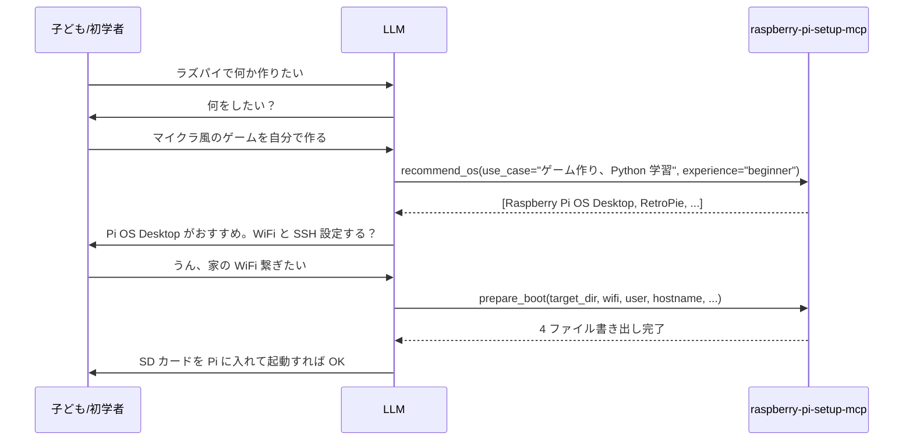

<div align="center">

# raspberry-pi-setup-mcp

### Raspberry Pi 初期セットアップ対話ウィザード MCP サーバー

[](src/index.ts)
[](package.json)
[](https://www.raspberrypi.com/software/)
[](https://modelcontextprotocol.io/)
[](LICENSE)

**「何に使う？」から相談に乗り、ヘッドレス起動ファイル一式を自動生成。**

---

</div>

## 概要

LLM エージェントが初学者（特に**子ども**）と対話してラズパイを立ち上げる為の MCP。用途ヒアリングからの OS 推薦、WiFi/SSH/ユーザー/ホスト名などの設定ファイル生成までを一撃で。

LLM に `ffmpeg -i ...` を書かせないのと同じ理屈で、LLM に `wpa_supplicant.conf` や `userconf.txt` を**手書きさせない** — 間違うと初回起動で詰む。このサーバーは正しいフォーマット・権限・配置場所を保証する。

## 特徴

| アクション | 用途 |
|---|---|
| `list_os` | カタログ全件（Pi OS / Ubuntu / LibreELEC / RetroPie / HASS / DietPi / Alpine 等）を `good_for` タグ付きで返す |
| `recommend_os` | `use_case` (日本語 OK) + `experience` で 5 件推薦 |
| `generate_wpa_supplicant` | `wpa_supplicant.conf` 本文生成（WPA-PSK / オープン / 複数 SSID 対応） |
| `generate_userconf` | Bookworm 以降の `userconf.txt` 生成。`password` (openssl で hash 化) か `password_hash` 直指定 |
| `generate_firstrun` | 初回起動スクリプト `firstrun.sh` 生成（ホスト名 / ロケール / TZ / SSH 公開鍵配置 / 任意コマンド） |
| `enable_ssh_instructions` | `ssh` 空ファイルの作り方説明 |
| `prepare_boot` | `target_dir` に上記を**まとめて書き出す**（SD の boot パーティションを直接指定する想定） |
| `hash_password` | `password` → `$6$...` SHA-512 crypt ハッシュ |
| `check_requirements` | openssl / rpi-imager / Node / platform の検出 |
| `cloud_init_ubuntu` | **Ubuntu Server Pi 用 user-data YAML 生成**。hostname / timezone / locale / user (password は openssl で自動 hash) / `ssh_pubkey` / `wifi` (netplan 形式) / `packages` / `runcmd` |
| `dietpi_config` | **DietPi 固有の dietpi.txt + dietpi-wifi.txt** を同時生成。locale / keyboard_layout / timezone / `dietpi.headless` / `dietpi.ssh_server` / `dietpi.autostart` 対応 |
| `list_block_devices` | Windows (PowerShell `Get-Disk`) / macOS (`diskutil`) / Linux (`lsblk -J`) をプラットフォームごとに叩いて JSON 正規化 |
| `generate_ssh_keypair` | `node:crypto` を使った in-process ed25519 キーペア生成（シェルアウト不使用）。`ssh_key_comment` / `ssh_key_type` 対応、SHA256 フィンガープリント付き（`ssh_key_bits` は ed25519 固定長のため不使用） |

## 想定フロー


```mermaid
sequenceDiagram
    participant Kid as 子ども/初学者
    participant LLM
    participant MCP as raspberry-pi-setup-mcp

    Kid->>LLM: ラズパイで何か作りたい
    LLM->>Kid: 何をしたい？
    Kid->>LLM: マイクラ風のゲームを自分で作る
    LLM->>MCP: recommend_os(use_case="ゲーム作り、Python 学習", experience="beginner")
    MCP-->>LLM: [Raspberry Pi OS Desktop, RetroPie, ...]
    LLM->>Kid: Pi OS Desktop がおすすめ。WiFi と SSH 設定する？
    Kid->>LLM: うん、家の WiFi 繋ぎたい
    LLM->>MCP: prepare_boot(target_dir, wifi, user, hostname, ...)
    MCP-->>LLM: 4 ファイル書き出し完了
    LLM->>Kid: SD カードを Pi に入れて起動すれば OK
```

## インストール

```bash
git clone https://github.com/cUDGk/raspberry-pi-setup-mcp.git
cd raspberry-pi-setup-mcp && npm install && npm run build
```

- Node.js >= 18.17 (`engines` で固定)
- Windows: `openssl.exe` が PATH にある事（Git Bash 付属版 or [公式](https://slproweb.com/products/Win32OpenSSL.html)）
- macOS/Linux: openssl は通常プリイン

## 使い方

```bash
claude mcp add rpi -- npx -y raspberry-pi-setup-mcp
# またはパス直指定:
claude mcp add rpi -- node /path/to/<install-dir>/dist/index.js
```

### 呼び出し例

用途相談:
```json
{"action": "recommend_os", "use_case": "Python プログラミング学習", "experience": "beginner"}
```

一括書き出し:
```json
{"action": "prepare_boot",
 "target_dir": "E:/",
 "wifi": {"ssid": "MyWiFi", "psk": "password", "country": "JP"},
 "enable_ssh": true,
 "user": {"username": "kiddo", "password": "learnpi"},
 "hostname": "pi-kiddo",
 "locale": "ja_JP.UTF-8",
 "timezone": "Asia/Tokyo"}
```

`target_dir=E:/` が SD の boot パーティションのマウント先。Windows だとドライブレターが自動で振られる。

**Ubuntu Server Pi のヘッドレス設定** (cloud-init):
```json
{"action": "cloud_init_ubuntu",
 "hostname": "pi-home",
 "timezone": "Asia/Tokyo",
 "user": {"username": "pi", "password": "setpasswd", "sudo_nopasswd": true},
 "wifi": {"ssid": "MyWiFi", "psk": "secret", "country": "JP"},
 "ssh_pubkey": "ssh-ed25519 AAAA... user@host",
 "packages": ["docker.io", "git", "vim"],
 "runcmd": ["usermod -aG docker pi"]}
```
→ `user-data` として `system-boot` パーティション直下に配置 (空の `meta-data` も必要)。

**DietPi の初期設定**:
```json
{"action": "dietpi_config",
 "hostname": "mydietpi",
 "timezone": "Asia/Tokyo",
 "wifi": {"ssid": "MyWiFi", "psk": "secret", "country": "JP"},
 "dietpi": {"password": "diet", "headless": true, "ssh_server": true}}
```
→ `dietpi.txt` と `dietpi-wifi.txt` を boot パーティションに置く。
- `dietpi.headless` は **省略時 `true` (= `AUTO_SETUP_HEADLESS=1`) がデフォルト** で、ヘッドレス・自動セットアップが走る。GUI 付き環境で対話的にセットアップしたい時のみ `dietpi.headless: false` を明示する事
- `dietpi.ssh_server` は省略時 `true` で、`AUTO_SETUP_SSH_SERVER_INDEX=-3` (OpenSSH) が出る

**SSH キーペア生成** (ed25519):
```json
{"action": "generate_ssh_keypair",
 "ssh_key_type": "ed25519",
 "ssh_key_comment": "pi-home@mymachine",
 "private_key_path": "C:/Users/me/.ssh/id_pi"}
```
→ 秘密鍵は `private_key_path` に mode 0600 で書き出され、レスポンスには **public key と fingerprint のみ** が含まれる。`publicKey` を `generate_userconf` の `ssh_pubkey` や `prepare_boot` にそのまま流し込める。

**利用可能ディスク列挙**:
```json
{"action": "list_block_devices"}
```

## firstrun.sh を有効化する

Raspberry Pi OS Bookworm の流儀:

1. `prepare_boot` で `firstrun.sh` を書き出す
2. SD の `cmdline.txt` の**末尾**（改行せず同一行）に以下を追記:
   ```
   systemd.run=/boot/firmware/firstrun.sh systemd.run_success_action=reboot systemd.unit=kernel-command-line.target
   ```
3. 初回起動時に 1 回だけ実行されて自動削除される

## セキュリティモデル（読んで）

このサーバーが生成するファイルは Pi 上で **root 権限で実行** される。
従って入力（hostname / username / timezone / locale / country / ssh_pubkey / commands / target_dir / ssid / psk / password_hash 等）は **シェルインジェクションを許せばそのまま root RCE になる**。
本サーバーは以下の防御をかけている:

- `hostname` は RFC 1123、`username` は POSIX (`^[a-z_][a-z0-9_-]{0,31}$`)、`locale` / `country` / `timezone` も厳格 regex / IANA リスト で検証
- `ssh_pubkey` は鍵タイプ prefix 必須、改行・バックスラッシュ・`$`・``` ` ```・`"` を含むものは拒否（heredoc で `authorized_keys` に書く）
- `firstrun_commands[]` は 1 行 1 コマンド、改行不可
- `psk` は WPA-PSK の 8〜63 文字制限、`key_mgmt=NONE` と `psk` の同時指定は拒否
- `password_hash` は `$6$...` (SHA-512) または `$y$...` (yescrypt) のみ受理
- `target_dir` は `/`, `/etc`, `/usr`, `/boot`, `/home`, `C:\Windows`, `C:\Program Files`, システムドライブ直下を拒否（`RPI_ALLOW_TARGET_DIR=1` でバイパス）
- DietPi の `dietpi` 既定パスワード "dietpi" は廃止。`dietpi.password` か `dietpi.password_hash` を**必ず**渡す事
- cloud-init は `plain_text_passwd` を一切吐かない。`password` を渡したら openssl で hash 化する
- `sudo_nopasswd` は **明示的に `true` を渡した場合のみ** NOPASSWD を出力（既定 false）
- `generate_ssh_keypair` は `ssh-keygen` をシェルアウトせず `node:crypto` の `generateKeyPairSync('ed25519')` を使う。秘密鍵は `private_key_path` に mode 0600 で書き、レスポンスには含めない

## 環境変数

- `RPI_ALLOW_TARGET_DIR=1` — `target_dir` の安全チェックをバイパス（テスト用）
  - 既定では Unix系の `/etc`, `/usr`, `/boot`, `/home`, `/root` 直下 / Windows の `C:\Windows`, `C:\Program Files` 直下 を拒否
  - **Windows ではさらに `%SystemDrive%` (通常 `C:`) 直下も拒否される**（SD カードでなく Cドライブに書き出して事故るのを防ぐ目的）。SD カードを別ドライブレターでマウントしてから `target_dir` を指定するか、本フラグでバイパスすること
  - シンボリックリンクは `realpath` で展開して再チェックするので、リンクで上記制限を迂回する事はできない

## 設計メモ

- **openssl 依存は薄め**。openssl が無くても `password_hash` を直接受け取れるので、ユーザー側で `openssl passwd -6` を手動実行すれば足りる
- **wpa_supplicant.conf は Bookworm 以降 deprecated**（NetworkManager に移行）だが、初回起動時の移行処理は残っているので当面は使える
- **子ども向けの配慮**: `recommend_os` で Lite/Alpine/DietPi は beginner にはスコアを下げる。GUI 付き Pi OS を積極的に推す
- **`flash_image` は未実装**。rpi-imager は GUI 推奨で、MCP で制御するメリットが薄い為。`list_block_devices` は実装済み

## v0.2.1 修正

- Claude Code 等の LLM クライアントから MCP ツールを呼ぶ時、object / array 型の引数が JSON 文字列化された状態で届くケースがあり、`wifi` / `user` / `dietpi` / `extra_networks` / `packages` / `runcmd` / `firstrun_commands` を受け取るハンドラで `p.wifi.ssid` 等が `undefined` になって壊れていた
- zod スキーマを `z.union([<本来>, z.string()])` に緩和し、ハンドラ先頭で `coerceObject` / `coerceArray` により文字列を JSON パースしてから使うようにした
- 影響するアクション: `prepare_boot`, `generate_wpa_supplicant`, `cloud_init_ubuntu`, `dietpi_config`, `generate_firstrun`

## Recent security fixes (R3/R4)

- Shell argument quoting hardened in `firstrun.sh` (hostname, timezone, locale, hosts entry)
- `ssh_pubkey` / `ssid` / `psk` blocklists extended to include `()|<>&;'` and single-quote respectively
- `dietpi.txt` values single-quoted; `RX_CRYPT_HASH` length bounds tightened (`$6$`: 10–106, `$y$`: 10–128)
- `sudo_nopasswd` in `prepare_boot` now correctly emits sudoers fragment in `firstrun.sh`
- `lsblk -o` updated to `MOUNTPOINTS` (util-linux ≥2.37); parser accepts both singular and plural forms
- `FORBIDDEN_TARGET_PREFIXES_NORMALIZED` filtered by platform (no cross-OS false positives)
- `ssh_key_bits` now throws when passed (ed25519 is fixed-length; parameter was misleading)
- `cloud_init_ubuntu` wifi field renamed `hidden` → `scan_ssid` for consistency with wpa_supplicant

## Attribution

- [Raspberry Pi OS](https://www.raspberrypi.com/software/)
- [Model Context Protocol](https://modelcontextprotocol.io/)

## ライセンス

MIT License © 2026 cUDGk — 詳細は [LICENSE](LICENSE) を参照。
